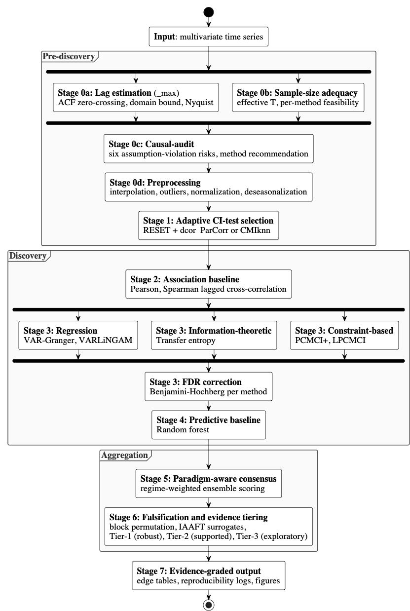

# AutoCause

[](https://www.python.org/downloads/)
[](https://www.gnu.org/licenses/agpl-3.0)
[](tests/)
[](https://arxiv.org/abs/XXXX.XXXXX)

**AutoCause** automates expert decisions in environmental time-series causal discovery:
method selection, lag choice, CI-test selection, sample-size adequacy, FDR correction, and evidence grading.

| Method | Paradigm | CI test / engine | Library |
|--------|----------|------------------|---------|
| VAR-based Granger | Regression (conditional) | *F*-test on multivariate VAR | `statsmodels` |
| Transfer entropy | Information-theoretic | CMIknn surrogates | `tigramite` |
| PCMCI+ | Constraint-based | Auto: ParCorr / RobustParCorr / CMIknn | `tigramite` |
| LPCMCI | Constraint-based (latent confounders) | Auto | `tigramite` |
| VAR-LiNGAM | Score-based (ICA) | Bootstrap pruning | `lingam` |
| RF-baseline | Predictive (non-causal) | Permutation importance | `scikit-learn` |

The first five are causal discovery methods from the dominant paradigms. The RF-baseline is a predictive reference included to answer: "does causal discovery find something different from feature importance?"

## Installation

```bash
uv venv .venv --python 3.13
source .venv/bin/activate
uv pip install -e .
```

## Usage

```python
import pandas as pd
from framework.core.run_workflow import run_causal_discovery_workflow

# Input: DataFrame with DatetimeIndex, one column per variable, NaN for missing
df = pd.read_csv("data.csv", index_col=0, parse_dates=True)

results = run_causal_discovery_workflow(
    data_df=df,
    output_dir="results/",
    target_var="FCH4",
    alpha=0.05,
    sampling_days=1,
    deseasonalize=True,              # subtract rolling mean before discovery
    true_edges={("X","Y")},          # optional: if ground truth available, computes F1, AUROC, AUPRC
    enable_consensus=True,           # multi-method voting
    enable_causal_audit=True,        # run causal-audit assumption diagnostics first
    method_config={
        "granger":              {"enabled": True},   # conditional VAR-based Granger (statsmodels)
        "transfer_entropy":     {"enabled": True},   # CMIknn nearest-neighbour estimator (tigramite)
        "pcmci":                {"enabled": True, "test_method": "parcorr"},  # PCMCI+ constraint-based (tigramite)
        "varlingam":            {"enabled": True},   # ICA-based VAR-LiNGAM (lingam)
        "lpcmci":               {"enabled": False},  # LPCMCI for latent confounders (tigramite)
        "correlation":          {"enabled": True},   # lagged Pearson/Spearman (non-causal baseline)
        "predictive_baseline":  {"enabled": True},   # Random Forest permutation importance (scikit-learn)
        "ci_sensitivity":       {"enabled": True},   # compare ParCorr vs RobustParCorr vs CMIknn
    },
)
```

For detailed options (audit-only mode, adaptive CI-test selection, sample size adequacy, PCMCI vs PCMCI+, graph recovery metrics), see [`docs/USAGE.md`](docs/USAGE.md).

## Pipeline



**A. Data and assumptions**

1. **τ<sub>max</sub> estimation**: ACF zero-crossing, domain constraint, Nyquist bound
2. **Sample size adequacy**: method-specific *T*<sub>min</sub> checks, CI-test fallback
3. **Preprocessing**: outlier removal, interpolation, normalization, stationarity check
4. **Deseasonalization** (optional): rolling-mean subtraction to remove annual cycles
5. **[causal-audit](https://github.com/marcoruizrueda/causal-audit)** (optional): assumption diagnostics, risk scores, method recommendation
6. **Distribution tests**: Gaussianity, linearity → CI test recommendation
7. **Correlation analysis**: Pearson, Spearman, distance correlation (symmetric baseline)

**B. Discovery**

<!-- continued from A -->

8. **VAR-based Granger causality**: conditional *F*-tests (all controls for *N* ≤ 10)

9. **PCMCI+**: momentary conditional independence with adaptive CI test

10. **LPCMCI**: PCMCI+ extended for latent confounders (outputs PAG)

11. **VAR-LiNGAM**: ICA on VAR residuals (non-Gaussian identifiability)

12. **Transfer entropy**: *k*-NN conditional mutual information with surrogate *p*-values

13. **RF-baseline**: Random Forest feature importance (non-causal comparison)

**C. Validation and synthesis**

<!-- continued from B -->

14. **Graph recovery evaluation**: F1, SHD, AUROC, AUPRC against ground truth (when available)

15. **Ensemble scoring**: confidence-weighted aggregation across methods (regime-adaptive weights)

16. **Power analysis**: minimum detectable effect size (MDES) per method

17. **CI-test sensitivity**: compare edges across ParCorr / RobustParCorr / CMIknn

18. **Falsification**: block permutation + IAAFT surrogate tests

19. **ICP stability**: coefficient stability across environments

20. **Consensus**: multi-method voting with lag tolerance

21. **Tiered classification**: edges ranked by evidence strength

## Reproducing the paper experiments

All experiment scripts, configurations, and reproduction instructions are in
[`experiments/README.md`](experiments/README.md).

## Citation

--

## License

AGPL-3.0-or-later. Depends on Tigramite (GPL-3.0-or-later), which remains under its original license.
