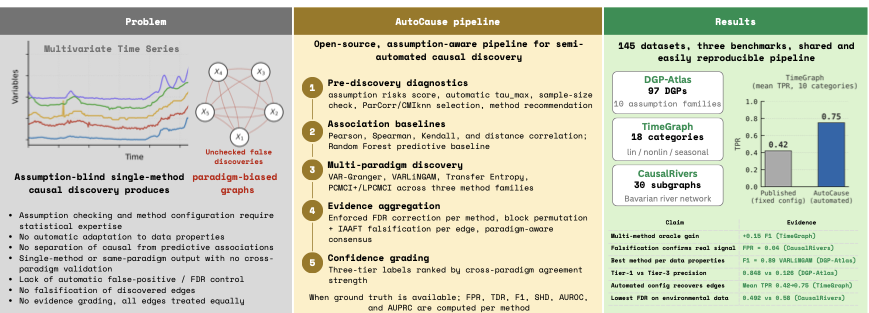

# Experiment Reproduction Guide



This directory contains all scripts needed to reproduce the experimental results
reported in the AutoCause paper.

## Quick Start

```bash
# Install AutoCause with all dependencies
cd /path/to/autocause
uv pip install -e ".[causal-audit]"

# Validate all scripts (no data needed)
python experiments/run_dgp_atlas.py --dry-run
python experiments/run_timegraph.py --dry-run
python experiments/run_causalrivers.py --dry-run
python experiments/make_figures.py --dry-run
```

## Data Sources

| Benchmark    | Source                                           | Download                                   |
|--------------|--------------------------------------------------|--------------------------------------------|
| DGP-Atlas    | Ruiz et al. (2026)                                      | https://zenodo.org/records/19409395        |
| TimeGraph    | Ferdous et al. (2025)                            | https://github.com/hferdous/TimeGraph      |
| CausalRivers | Stein et al. (2025)                              | https://github.com/CausalRivers/causalrivers |

Place datasets under `data/` in the project root:
```
autocause/
├── data/
│   ├── dgp_atlas/
│   │   ├── F1/dgp_001/data.csv
│   │   ├── F1/dgp_001/ground_truth.json
│   │   └── ...
│   ├── timegraph/
│   │   ├── A1/data.csv
│   │   ├── A1/ground_truth.json
│   │   └── ...
│   └── causalrivers/
│       ├── topology.json
│       └── discharge.parquet (or station CSVs)
└── experiments/
```

## Experiment Scripts

### Main Benchmarks (Section 4)

| Script                      | Paper section | Description                                    |
|-----------------------------|---------------|------------------------------------------------|
| `run_dgp_atlas.py`         | Section 4.2   | 97 DGP-Atlas datasets, 10 families             |
| `run_timegraph.py`         | Section 4.2   | 18 TimeGraph categories                        |
| `run_causalrivers.py`      | Section 4.2   | 30 CausalRivers subgraphs                     |

### Validation and Comparison

| Script                                          | Paper section | Description                              |
|-------------------------------------------------|---------------|------------------------------------------|
| `timegraph_validation/run_baseline_comparison.py` | Table 5      | Compare with published PCMCI+ values    |
| `falsification_validation/run_falsification.py`   | Appendix A.4 | IAAFT surrogate diagnostics             |

### Analysis and Figures

| Script                       | Paper element | Description                                |
|------------------------------|---------------|--------------------------------------------|
| `make_figures.py`            | Figs 2,3,4,5,7| Generate all paper figures                |
| `recompute_tier_metrics.py`  | Fig 3, Table 7| Consensus-support precision per tier      |
| `verify_causalrivers_tiers.py`| Section 4.3  | Verify tier-precision inversion           |
| `reproduce_fig8_tiers.py`    | Fig 8         | Tier visualization on F8/dgp_002          |

## Reproduction Sequence

The experiments should be run in this order:

```bash
# 1. Main benchmarks (can be parallelized)
python experiments/run_dgp_atlas.py --data-dir data/dgp_atlas --output-dir experiments/dgp_atlas/results
python experiments/run_timegraph.py --data-dir data/timegraph --output-dir experiments/timegraph_validation/results
python experiments/run_causalrivers.py --data-dir data/causalrivers --output-dir experiments/causalrivers_validation/results

# 2. Baseline comparison (requires TimeGraph data)
python experiments/timegraph_validation/run_baseline_comparison.py --data-dir data/timegraph

# 3. Falsification (requires all benchmark data)
python experiments/falsification_validation/run_falsification.py --data-dir data/

# 4. Tier metrics (requires main benchmark results)
python experiments/recompute_tier_metrics.py --results-dir experiments/

# 5. CausalRivers tier verification (requires CausalRivers results)
python experiments/verify_causalrivers_tiers.py --results-dir experiments/causalrivers_validation/results

# 6. Fig 8 reproduction (requires DGP-Atlas F8 data)
python experiments/reproduce_fig8_tiers.py --data-dir data/dgp_atlas

# 7. Generate all figures (requires all results)
python experiments/make_figures.py --results-dir experiments/
```

## Configuration Parameters (Section 4.1)

All experiments use fixed parameters matching the paper:

| Parameter    | Value | Description                                      |
|--------------|-------|--------------------------------------------------|
| `tau_max`    | 5     | Fixed lag window (not auto-estimated)            |
| `alpha`      | 0.05  | Significance threshold                           |
| FDR          | BH    | Benjamini-Hochberg (where applicable)            |
| LPCMCI       | off   | Excluded due to wall-time budget                 |

### CausalRivers-specific:
| Parameter       | Value   | Description                              |
|-----------------|---------|------------------------------------------|
| Resample        | 6h      | From 15-min to 6-hour resolution         |
| Year            | 2021    | Single calendar year                     |
| `sampling_days` | 0.25    | 6 hours = 0.25 days                      |
| Subgraphs       | 30      | 10 per topology class                    |
| Stations        | 5       | Per subgraph                             |

## Methods Evaluated

**Causal methods** (contribute to consensus tiers):
1. VAR-Granger (regression-based)
2. VARLiNGAM (regression-based, ICA)
3. Transfer entropy (information-theoretic)
4. PCMCI+ with adaptive CI test (constraint-based)

**Non-causal baselines** (excluded from consensus voting):
5. Lagged correlation
6. Random Forest predictive baseline

## Expected Runtime

Estimated on Apple M3 Pro / 16 GB RAM:

| Benchmark      | Datasets | Est. time    |
|----------------|----------|--------------|
| DGP-Atlas      | 97       | ~4-5 hours   |
| TimeGraph      | 18       | ~40 min      |
| CausalRivers   | 30       | ~2-3 hours   |
| Falsification  | 22       | ~12-15 hours |
| Fig 8          | 1        | ~3 min       |

## Output Structure

Each dataset produces:
```
results/<dataset>/
├── causal_audit/           # Pre-discovery diagnostics
├── method/                 # Per-method raw results
│   ├── granger/1-raw/results_granger.csv
│   ├── pcmci/1-raw/results_pcmci.csv
│   ├── transfer_entropy/1-raw/results_transfer_entropy.csv
│   └── varlingam/1-raw/results_varlingam.csv
├── consensus/5-tiers/consensus_with_tiers.csv
├── figures/                # Per-dataset visualizations
├── graph_recovery_metrics.csv
├── experiment_log.json
└── experiment.log
```

## Verifying Paper Claims

Key numerical claims that can be verified from the outputs:

1. **Table 3 (Mean F1)**: `dgp_atlas_family_summary.csv`, `timegraph_category_summary.csv`
2. **Fig 3 (Tier precision)**: `tier_metrics_all.csv`
3. **Table 5 (Baseline comparison)**: `baseline_comparison.csv`
4. **Table 7 (Vote thresholds)**: `vote_threshold_*.csv`
5. **Table A.4 (Falsification)**: `falsification_summary.csv`
6. **Section 4.3 (CausalRivers inversion)**: `tier_verification.json`

## HPC Usage

For HPC clusters with SLURM, each benchmark can be submitted as a separate job:

```bash
#!/bin/bash
#SBATCH --job-name=autocause-dgp-atlas
#SBATCH --time=06:00:00
#SBATCH --mem=16G
#SBATCH --cpus-per-task=4

module load python/3.13
source .venv/bin/activate
python experiments/run_dgp_atlas.py --data-dir $DATA_DIR --output-dir $RESULTS_DIR
```

For DGP-Atlas, individual families can be parallelized:
```bash
python experiments/run_dgp_atlas.py --families F1 F2 F3 --output-dir results/batch1
python experiments/run_dgp_atlas.py --families F4 F5 F6 --output-dir results/batch2
```

## Troubleshooting

- **Import errors**: Ensure `uv pip install -e ".[causal-audit]"` completed
- **Missing data**: Use `--dry-run` to check paths before full runs
- **Memory issues on CausalRivers**: Reduce `N_SUBGRAPHS_PER_CLASS` or run one class at a time
- **LPCMCI timeout**: LPCMCI is disabled by default; enable only with sufficient compute budget
